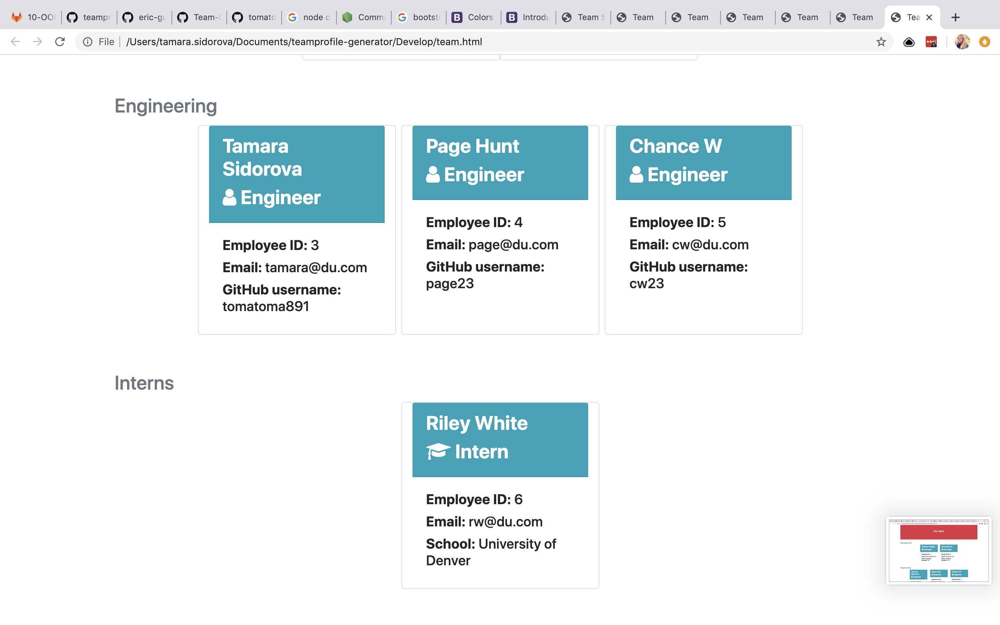
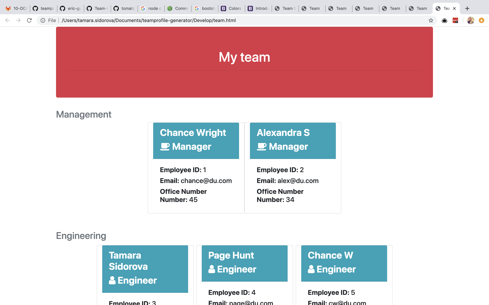
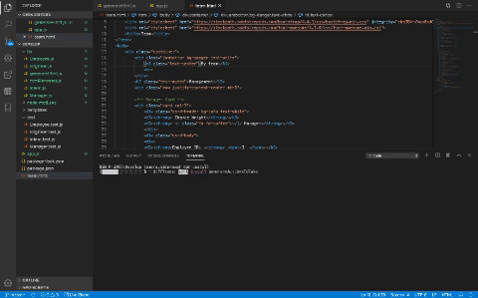

# teamprofile-generator
A software engineering team generator command line application. Using JavaScript, NPM Modules, Node.js

**User Story:**
As a manager I want to generate a webpage that displays my team's basic info so that I have quick access to emails and GitHub profiles

**Visuals:**
Final result as team.html profile

**Usage:**
1. Clone the repo locally
2. Run npm install to get required npm packages based on the package.json
3. Run using entry point app.js - node app.js
4. Answer the command line prompts
5. Select Exit from the menu when all employees have been entered
6. Open the team.html file to view the output
**Testing**
Jest was used to validate classes Use 'npm run test' to run the tests

**What I Learned**
* Experience using Async/Await for application execution
* Experience using ES6 and newer syntax, such as class, spread operator, and arrow functions
* Experience using npm modules, such as inquirer, chalk, boxen, and fs
* Back end experience using Node.js

